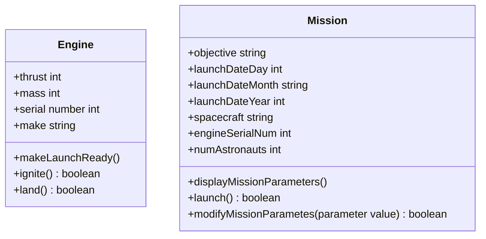

```mermaid
    classDiagram
        class Engine{
            +thrust int
            +mass int
            +serial number int
            +make string
            +makeLaunchReady()
            +ignite() boolean
            +land() boolean
        }

        class Mission{
            +objective string
            +launchDateDay int
            +launchDateMonth string
            +launchDateYear int
            +spacecraft string
            +engineSerialNum int
            +numAstronauts int
            +displayMissionParameters()
            +launch() boolean
            +modifyMissionParametes(parameter value) boolean
        }
```